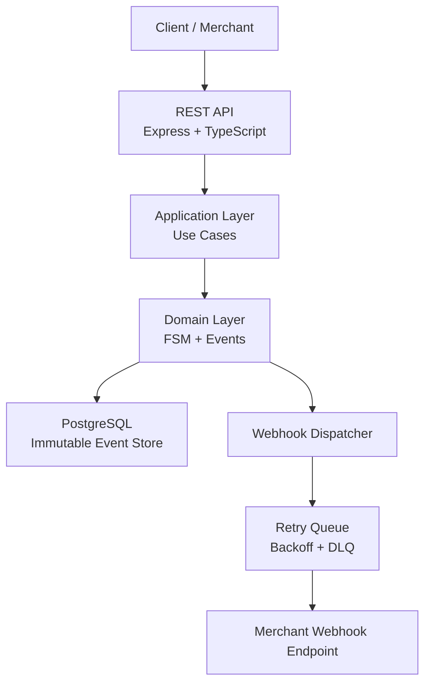

# 💳 QuantumPay — Event-Driven Payment & Webhook Reliability Platform  
### *Fintech-Grade • Idempotent APIs • Immutable Event Store • Production-Ready*


---

## 📖 Overview

**QuantumPay** is a **Stripe-inspired payment backend system** focused on **correctness, reliability, and failure safety**.  
Instead of UI-heavy demos, QuantumPay models how **real fintech systems** are built and reasoned about.

The system demonstrates:
- Deterministic payment state transitions  
- Immutable, append-only event sourcing  
- Idempotent APIs for safe retries  
- Production-grade webhook delivery  
- Failure-first engineering and observability  

> This project is built to mirror **real-world payment infrastructure**, not toy examples.

---

## 🎯 Why QuantumPay Exists

Payment systems operate in unreliable environments:
- Network failures  
- Client retries  
- Partial database commits  
- Webhook endpoint downtime  

**QuantumPay guarantees correctness even under repeated failures.**

---

## ✨ Core Guarantees

| Guarantee | Implementation |
|---------|----------------|
| Correct payment lifecycle | Strict Finite State Machine |
| Full audit trail | Immutable event store |
| Safe retries | Idempotency keys + request hashing |
| Webhook reliability | At-least-once delivery + retries |
| Failure tolerance | Retry queues + DLQ |
| Observability | Structured logs + metrics |

---

## 🏗️ Architecture

**Modular Monolith (Enterprise-Preferred)**

src/
 ├── domain/          # Pure business logic (FSM, entities)
 ├── application/     # Use cases and orchestration
 ├── infrastructure/  # DB, queues, external systems
 ├── api/             # REST controllers and Idempotency
 ├── workers/         # Async webhook processors with DLQ
 └── tests/           # Unit, integration, failure tests
```

---

## 🚀 Quick Start

1. **Start the Infrastructure (PostgreSQL 15):**
   ```bash
   cd QuantumPay-backend
   docker-compose up -d
   ```

2. **Install & Run the Backend:**
   ```bash
   npm install
   npm run dev
   ```

3. **Run the End-to-End Demo Script:**
   In a new terminal window, watch the system in action:
   ```bash
   npm run demo
   ```
   *This script simulates a client creating, authorizing, and capturing a payment, while simultaneously spinning up a local webhook receiver to catch the dispatched events from the background worker.*

##  Key Features

---

###   Payment State Machine (FSM)

Payments follow a strict lifecycle:

INITIATED → AUTHORIZED → CAPTURED
↘ FAILED
CAPTURED → REFUNDED


**Rules**
- No skipped states  
- No backward transitions  
- One event = one state change  

Illegal transitions are explicitly rejected to ensure **financial correctness**.

---

###  Immutable Event Store (Event Sourcing)

All payment changes are stored as append-only events.




## License

MIT License © 2026 QuantumPay
